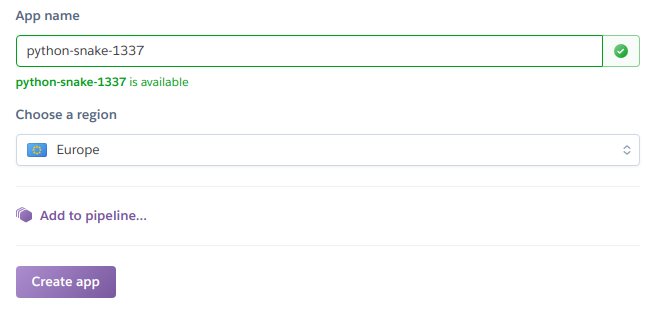
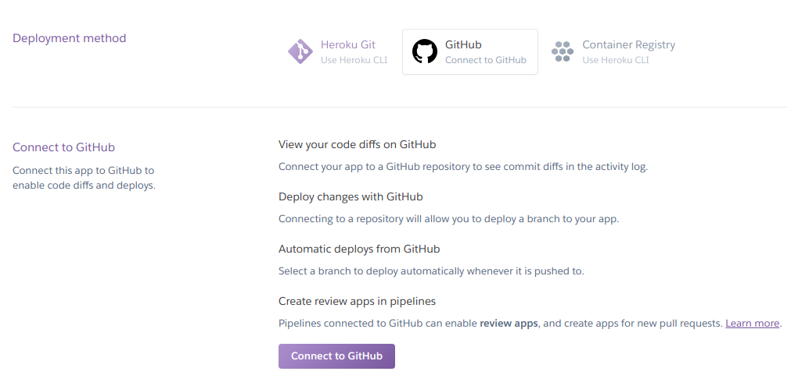

# Battlesnake-event

_Vi rekommenderar starkt att ni använder någon Linux-distribution, eller en 
virtuell maskin med Linux, då testande har visat sig fungera bäst där.
macOS bör också fungera. Windows är däremot ej fungerande i nuläget (fungerar 
eventuellt med Windows 10 Professional, men ej testat)._

### Hittills testade konfigurationer för utveckling

Bättre fungerande konfigurationer:
* Ubuntu 18: _Fungerande (Docker, Python, Java)_
* Ubuntu 18 i en virtuell maskin på Windows 10 Professional: _Fungerande (Docker, Python, Java)_
* macOS Mojave 10.14.3: _Fungerande (Docker, Python, Java)_

Sämre/ej fungerande konfigurationer:
* :x: Windows 10 med Docker Toolbox: _Ännu ej fått fungerande._
* :x: Windows Subsystem for Linux: _Docker kan ej köras i WSL. Python-orm fungerar._

##API 2017 (bör fungera smidigt med denna version av servern): <https://stembolthq.github.io/battle_snake/>

En del dokumentation finns även längre ner i denna README (i den del 
från originalrepot).

## "Starter snakes", kodskelett till ormar

Dessa bör sköta det mesta av "boilerplate"-arbetet åt er, t.ex. gällande 
respons för `/start` och `/end` requests, och ger oftast någon sorts 
startpunkt för respons till `/move` requests (som får ormen att förflytta 
sig).

* Python: https://github.com/battlesnakeio/starter-snake-python
* Java: https://github.com/battlesnakeio/starter-snake-java
* NodeJS: https://github.com/battlesnakeio/starter-snake-node
* Haskell: https://github.com/Rewbert/starter-snake-haskell

Instruktioner för hur ni installerar och startar ormarna finns på respektive 
sida.

## Köra battlesnake-server i Docker container

Spelservern ("arenan") kan köras genom Docker, vilket gör det smidigt att 
testa era ormar.

### Installera Docker (Ubuntu)

Senaste versionen av Docker Community Edition finns 
[här](https://docs.docker.com/install/linux/docker-ce/ubuntu/).

En äldre (men fungerande) version finns också i repot:

```
sudo apt install docker.io
```

### Installera Docker (macOS)

Docker Desktop finns att ladda ned 
[här](https://www.docker.com/products/docker-desktop).

### Hämta och kör docker-container med server

Testa om Docker installerats korrekt genom att skriva `docker --version` 
i terminalen.

För att sedan hämta Docker-containern med servern på, kör:

```
sudo docker pull sendwithus/battlesnake-server
sudo docker run --rm -it -p 3000:3000 sendwithus/battlesnake-server
```

Servern kan sedan nås via <http://localhost:3000>.

Notera att om ni vill testa er orm som ni kör lokalt, kan ni ej referera till 
den genom `localhost` i UI:et (pga. Docker). Dvs. kommer 
`http://localhost:<port>` ej att fungera; istället måste ni referera till 
datorns IP-adress, något i stil med `http://192.168.1.131:<port>`, där 
`<port>` syftar på den port som er orm lyssnar på (t.ex. 8080).

IP-adressen kan ni få genom att t.ex. köra `ip addr` eller `ifconfig`. 
För min dator, på Monadens nätverk, ger t.ex `ip addr | grep 192` 
följande utskrift:
```
inet 192.168.1.131/24 brd 192.168.1.255 scope global dynamic noprefixroute wlp2s0
```

Här är `192.168.1.131` adressen, och om porten som ormen lyssnar på är `8080` 
så skriver vi följande i spelserverns URL-fält för ormar:
`http://192.168.1.131:8080`.


Om ni vill köra flera ormar samtidigt (för testning), glöm inte att ge dem 
olika portar att lyssna på!

## Skapa konto och GitHub-anslutning på Heroku

Börja med att skapa ett konto på [heroku.com](https://www.heroku.com/).

Välj "Create new app":


---

Skriv in ett namn och välj region:



---

Under "Deployment method", välj "GitHub" och sedan "Connect to GitHub", 
godkänn auktorisering:




---

När kontot är anslutet till GitHub kan ni ansluta appen till ert repo för 
er orm-AI:


---

Till slut kan ni låta Heroku bygga er app under "Manual deploy", och sedan 
klicka på "Open app" i övre högra hörnet för att få URL:en till er orm. Det 
är från dessa URL:er som vi kommer att hämta ormarna för att tävla mot varandra:


# Nedanstående kommer från officiella repot:

### Game Rules

#### Avoid Walls

If a snake leaves the last tile of the board, they will die.


#### Eat Food

Eating a food pellet will make snakes one segment longer. Snakes grow out of
their tail: new tail segment will appear in the same square that the tail was in
the previous turn.

Eating a food pellet will restore snakes' health-points to 100.

The amount of food can vary from game to game, but within the same game it will
always stay the same. As soon as a piece of food is eaten, it will respawn at a
random, unoccupied location on the next turn.


#### Don't Starve

Every turn snakes will loose one health-point. In BattleSnake health-points
serve like the snake's hunger bar, and if it reaches zero, the snake will starve
and die. Eating food will restore snake's health to one-hundred points on the
next turn.


#### Don't Collide with Snakes' Tails

If a snake collides with itself or any other snakes' tails, it dies.


#### Head on Collisions

Head-to-head collisions follow different rules than the previously mentioned
tail collisions.

In head-on collisions, the longer snake will survive.


But if both snakes are the same size, they both die. Note that in the below
scenario, the food remains (collisions are resolved before food is eaten).


## Testing Your Snake

If you have a game server running locally you can visit `/test`, plug your
snake's URL in and a number of tests will be run against your server, checking
if it follows all the basic game rules.

## API Webhooks

All interactions with the game are implemented as HTTP POST webhooks. Once the
game has begun your server will receive a request to your `/start` endpoint, and
then on each turn a request to the `/move` endpoint. When a game has completed and the last move has been processed, a request to the `/end` endpoint will be made with information about which snake won, dead snakes, and death reasons.

### POST `/start`

A request including the `game_id` will be issued to this endpoint to signify the start of a new game. The game server expects a JSON response with some information about your snake in order to start the game.

You can customise your snake with a head and tail type from the lists below:

#### Head Types

String referring to what head image should be used for your snake.

Renders one of the matching images in [this directory](./assets/static/images/snake/head/).

- `bendr`
- `dead`
- `fang`
- `pixel`
- `regular`
- `safe`
- `sand-worm`
- `shades`
- `smile`
- `tongue`

#### Tail Types

String referring to what tail image should be used for your snake.

Renders one of the matching images in [this directory](./assets/static/images/snake/tail/).

- `block-bum`
- `curled`
- `fat-rattle`
- `freckled`
- `pixel`
- `regular`
- `round-bum`
- `skinny`
- `small-rattle`

#### Example `/start` Request

```json
{
  "game_id": 1,
  "width": 20,
  "height": 20
}
```

#### Example `/start` Response

```json
{
    "color": "#FF0000",
    "secondary_color": "#00FF00",
    "head_url": "http://placecage.com/c/100/100",
    "taunt": "OH GOD NOT THE BEES",
    "head_type": "pixel",
    "tail_type": "pixel"
}
```

### POST `/move`

A request including all the current game information will be issued to this
endpoint on each turn. The game server expects a JSON response within 200ms.

#### Example `/move` Request

```json
{
  "food": {
    "data": [
      {
        "object": "point",
        "x": 0,
        "y": 9
      }
    ],
    "object": "list"
  },
  "height": 20,
  "id": 1,
  "object": "world",
  "snakes": {
    "data": [
      {
        "body": {
          "data": [
            {
              "object": "point",
              "x": 13,
              "y": 19
            },
            {
              "object": "point",
              "x": 13,
              "y": 19
            },
            {
              "object": "point",
              "x": 13,
              "y": 19
            }
          ],
          "object": "list"
        },
        "health": 100,
        "id": "58a0142f-4cd7-4d35-9b17-815ec8ff8e70",
        "length": 3,
        "name": "Sonic Snake",
        "object": "snake",
        "taunt": "Gotta go fast"
      },
      {
        "body": {
          "data": [
            {
              "object": "point",
              "x": 8,
              "y": 15
            },
            {
              "object": "point",
              "x": 8,
              "y": 15
            },
            {
              "object": "point",
              "x": 8,
              "y": 15
            }
          ],
          "object": "list"
        },
        "health": 100,
        "id": "48ca23a2-dde8-4d0f-b03a-61cc9780427e",
        "length": 3,
        "name": "Typescript Snake",
        "object": "snake",
        "taunt": ""
      }
    ],
    "object": "list"
  },
  "turn": 0,
  "width": 20,
  "you": {
    "body": {
      "data": [
        {
          "object": "point",
          "x": 8,
          "y": 15
        },
        {
          "object": "point",
          "x": 8,
          "y": 15
        },
        {
          "object": "point",
          "x": 8,
          "y": 15
        }
      ],
      "object": "list"
    },
    "health": 100,
    "id": "48ca23a2-dde8-4d0f-b03a-61cc9780427e",
    "length": 3,
    "name": "Typescript Snake",
    "object": "snake",
    "taunt": ""
  }
}
```

#### Example `/move` Response

```json
{
  "move": "up"
}
```

### POST `/end`

A request including end game information such as winners, dead snakes, and death reasons will be issued to this endpoint at the end of the game.

Possible death causes are:

- `body collision`
- `head collision`
- `self collision`
- `starvation`
- `wall collision`

#### Example `/end` Request

```json
{
  "game_id": 10,
  "winners": [ "a46b558b-f31b-418f-bb07-6017dd91f653" ],
  "dead_snakes": {
    "object": "list",
    "data": [{
      "id": "4a35fd1c-434b-431b-839c-edf958d67e9a",
      "length": 3,
      "death": {
        "turn": 4,
        "causes": ["self collision"]
      }
    }]
  }
}
```

#### Example `/end` Response

Simply return a 200 OK response, the server will stop processing this game moving forward.

## Development

### Running with Docker

You can run the official BattleSnake game server through Docker, allowing you to develop your snakes locally and whenever you want.

```sh
docker pull sendwithus/battlesnake-server
docker run --rm -it -p 3000:3000 sendwithus/battlesnake-server
```

You can then view the game server at <http://localhost:3000>.

**NOTE**: If you are running your snake on localhost or on the same local machine where you're running the game server, you won't be able to reference it as `localhost` in the game setup UI because the game server docker container runs on its own network. What this means for you is that you will need to use your computer's IP address (something like `http://192.168.1.10:<port>`) as your snake URL in order to add it to a game and not `http://localhost:<port>`.
